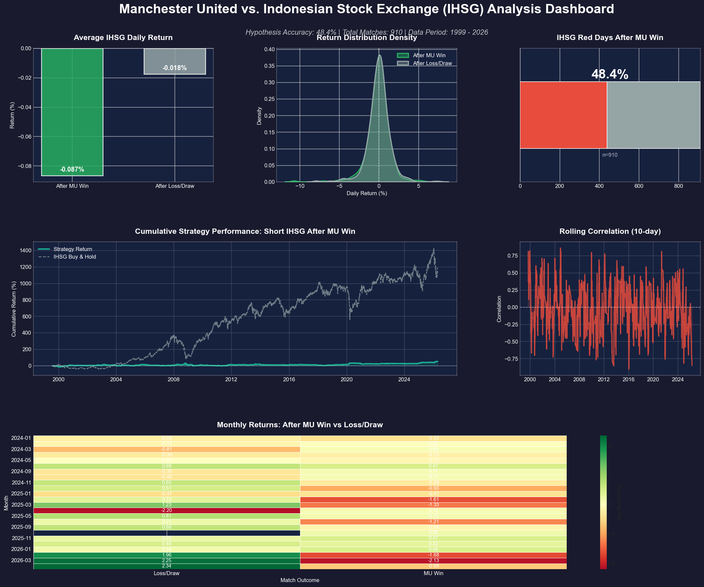
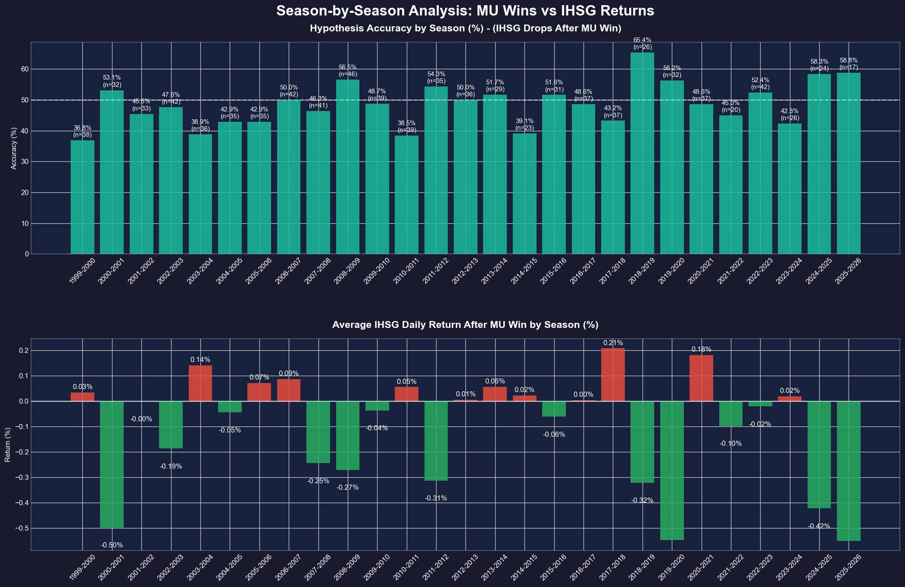

# Manchester United vs. IHSG Hypothesis

A data-driven backtesting tool to investigate whether **Manchester United match results correlate with Indonesian Stock Exchange (IHSG/^JKSE) market movements** on the next trading day.

## The Hypothesis

> When Manchester United wins a match, the IHSG tends to close **red** (negative) the following trading session.

This project fetches real match results and stock data, aligns them to the next available trading day, and computes statistical accuracy + a simulated short strategy.

---

## 📊 Current Findings (2000 - 2026)

Based on the latest analysis of **910 MU Wins** over 26 years:

- **Hypothesis Accuracy**: **48.35%**
- **Avg Return After Win**: **-0.0866%**
- **Avg Return After Loss/Draw**: **-0.0176%**

The results show a slight negative bias in IHSG returns following an MU win, though the frequency of "red days" is close to a coin flip.

### Overall Performance



### Season-by-Season Breakdown

To better understand these findings over time, the performance is also broken down by football season (August - May), revealing periods where the hypothesis held a much stronger edge.



---

## Features

- **Hardcoded Historical Data**: Includes a comprehensive dataset of MU matches from **2000 to 2026** (1,528 matches).
- **Multi-source football fallback**: Live scraping from FBref and Football-Data.org API for recent data.
- **Local CSV caching**: Optimizes performance by storing stock data locally.
- **Sophisticated Analytics Dashboard**: A premium 6-panel visualization including:
    - Average returns comparison
    - Return distribution density (KDE)
    - Hypothesis accuracy gauge
    - Cumulative strategy vs. Buy & Hold benchmark
    - Rolling 10-day correlation
    - Monthly performance heatmap
- **Season-by-Season Analysis**: Detailed breakdown of accuracy and average returns for each football season.

---

## Setup

### 1. Clone the repo

```bash
git clone https://github.com/your-username/muihsghypothesis.git
cd muihsghypothesis
```

### 2. Create a virtual environment

```bash
python -m venv venv
# Windows
venv\Scripts\activate
# macOS / Linux
source venv/bin/activate
```

### 3. Install dependencies

```bash
pip install -r requirements.txt
```

---

## Usage

```bash
# Run the full analysis (uses the hardcoded 2000-2026 dataset)
python muihsg.py

# Force refresh stock data (ignores cache and fetches fresh data from Yahoo Finance)
python muihsg.py --refresh
```

---

## Data Sources

| Source | Type | Notes |
|---|---|---|
| [11v11.com](https://www.11v11.com) | Static | **Primary** — Hardcoded history (2000-2026) |
| [FBref](https://fbref.com) | Scraping | Fallback for recent live matches |
| [football-data.org](https://www.football-data.org/) | API | Secondary fallback |
| [Yahoo Finance (^JKSE)](https://finance.yahoo.com/quote/%5EJKSE/) | API via `yfinance` | IHSG daily data |

---

## Project Structure

```
muihsg-vs-ihsg/
├── muihsg.py                   # Main analysis engine
├── mu_history_2000_2026.csv    # Hardcoded MU match dataset
├── data_source/                # Research tools and raw evidence
│   ├── scraper_11v11.py        # Parser used to generate the dataset
│   └── 11v11_match_records/    # Original source records (HTML/Text)
├── requirements.txt            # Python dependencies
├── README.md                   # This file
└── .gitignore                  # Excludes local caches
```

---

## Disclaimer

This project is for **educational and entertainment purposes only**. It does not constitute financial advice. Correlation is not causation — especially when the cause is a football team.
